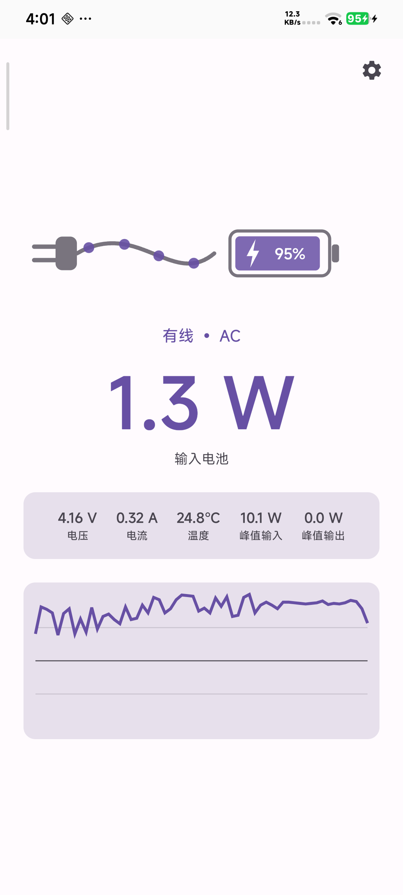

# ⚡ WattFlow

[](https://developer.android.com)
[](https://kotlinlang.org)
[](LICENSE)
[](https://buymeacoffee.com/williamoz)

**See the real watts flowing in and out of your battery — wired or wireless, in real time.**

[简体中文](README.zh-CN.md)

<p align="center">
  
</p>

## Features

- **Live power readout** — voltage × current sampled every second, shown in watts
- **Wired & wireless** — detects AC / USB / Wireless / Dock sources automatically
- **Animated visuals** — current dots flowing along the cable when wired, pulsing waves when wireless, outflow animation when discharging
- **Peak In / Peak Out** — tracks maximum charging and discharging power of the session
- **Live graph** — last 60 seconds of power history, discharge shown below the zero line
- **Battery stats** — voltage, current, temperature, and charge level inside the battery icon
- **12 languages** — auto-follows system, with a manual override in settings
- **No ads, no analytics** — nothing about you ever leaves this device.

## How It Works

Power is computed from Android's public `BatteryManager` API:

```
watts = EXTRA_VOLTAGE (mV) × BATTERY_PROPERTY_CURRENT_NOW (µA)
```

The app normalizes two well-known OEM quirks:

- Some devices report current in **mA instead of µA** (values are scaled by a plausibility heuristic)
- Sign conventions differ per vendor (normalized to: charging = positive)

### Accuracy Disclaimer

The displayed value is **battery-side power** — what actually enters or leaves the battery cell. Wall power is always higher due to:

- Conversion losses (~10–15% wired, ~30–40% wireless)
- Power consumed directly by the device (screen, CPU, radios) while charging

There is no public Android API for adapter-side wattage, so this is the most honest number an unrooted device can show.

### Reverse Charging

When your phone powers another device (reverse wireless charging, OTG), Android exposes no "reverse charging" flag — the app shows it as battery drain with the correct wattage.

## Languages

English, 简体中文, 繁體中文, Español, العربية, Bahasa Indonesia, Português, Français, 日本語, 한국어, Русский, Deutsch

Translations live in `app/src/main/res/values-*/strings.xml` — corrections and new languages are welcome via PR.

## What's New — v1.3

- **Charger benchmark**: 60-second test grades your charger + cable
  (avg/peak watts, stability, A–F); Pro saves and compares results
- **Floating watts overlay** (Pro): draggable live-watts pill over other apps
- **Energy ledger, sleep drain report and battery health trend** (Pro)
- **Dual-cell (2S) hint + manual ×2 correction** for phones that
  under-report power during fast charging
- **Landscape two-pane layout**, size-adaptive widget, settings tab,
  readable chart peak labels

- **1.3.1–1.3.2**: in-app language now works on Play-installed builds;
  widget picker offers three preset sizes with previews
- **1.3.3–1.3.5**: battery alerts clear themselves once followed; widget
  picker entries renamed Small/Medium/Large with clean transparent
  previews; 4×1 widget squeezes to 3 columns (with a guaranteed gap
  between its text columns); notification follows a language switch
  instantly; dual-cell report opens a prefilled GitHub issue form
- **1.3.6**: a session cut short by the process being killed
  mid-recording is now recovered from a checkpoint and shown in
  History as interrupted, instead of silently vanishing
- **1.3.7**: a recovered checkpoint whose battery level moved the wrong
  way for its direction is discarded instead of recorded; any such
  sessions already recorded are purged on update
- **1.3.8**: merged History sessions that span a source change now say
  "Mixed" instead of guessing; Peak In/Out gets an ⓘ on the Live tab
  and a "Today's Peaks" header on the widget to clarify it's two
  different scopes (current streak vs. today), not a bug

Full history in [CHANGELOG.md](CHANGELOG.md).

## FAQ

**Why is the number lower than what my charger shows?**

Three real reasons — not a bug:

1. **Different measurement points.** WattFlow shows battery-side power (what actually enters the battery). Your charger shows its own output, upstream of the whole conversion chain.
2. **Conversion losses.** ~10% wired, 30–40% wireless (coil coupling turns into heat). A 40 W wireless pad delivering ~25 W into the battery is completely normal.
3. **The system eats first.** Screen, SoC and radios draw power directly from the charge path while you watch the app — that share never reaches the battery.

Bonus: a 100 W charger doesn't force 100 W. The phone draws only what its charging protocol negotiates at the current battery level, and tapers hard past ~70%.

## Build

Requirements: JDK 17+, Android SDK 35.

```bash
./gradlew assembleDebug
# APK at app/build/outputs/apk/debug/app-debug.apk
```

Minimum Android version: 8.0 (API 26).

## Support

If this app is useful to you, consider buying me a coffee ☕

<a href="https://buymeacoffee.com/williamoz"></a>

## License

[MIT](LICENSE) — free to use, modify, and distribute.
